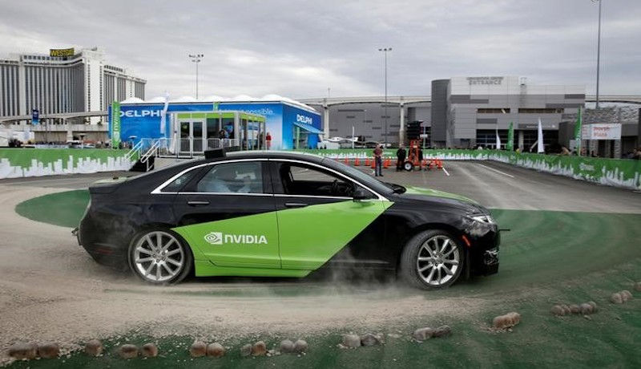
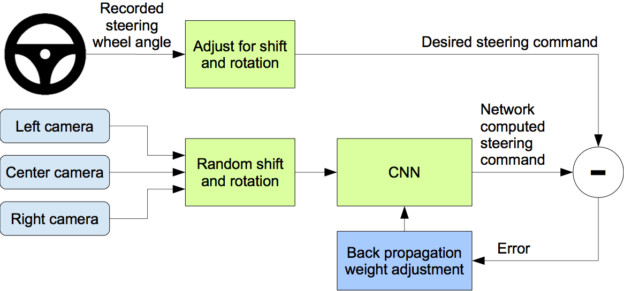

# Self-Driving Car Project: End-to-End Learning

Hello there! I'm Babak. Let me introduce you to my project. In this project I trained a convolutional neural network (CNN) to map raw pixels from a three
front-facing cameras (left, center, right) directly to steering commands. This end-to-end approach
proved surprisingly powerful method to teach the self-driving car drive without explicitly training the car to detect, for example, the outline
of roads. This project was written using Python object oriented programming.

**Contents**   

* model.py containing the script to create and train the model
* model.h5 containing a trained convolution neural network 
* drive.py for driving the car in autonomous mode
* Readme.md file summarizing the results
* Training images from three cameras
* Training driving log (speed, steering angles)

### Pipeline:

The steps of this project are the following:

* Use a simulator to collect data of good driving behavior
* Build a convolution neural network in Keras that predicts steering angles from images
* Train and validate the model with a training and validation set
* Test that the model successfully drives around track one without leaving the road
* Summarize the results with a written report

Main stages of end-to-end learning can be seen below: 

### Detailed Design Approach

The overall strategy for deriving a model architecture was:

- Designing the nueral network architecture
- Data collection using a simulator
- Data preprocessing
- Data augmentation
- Splitting data into training and validation sets
- Training the model on the NN architecture
- Saving the model
- Testing the model on a simulator
- Creating video of successful drive around the track

#### 1. Final Model Architecture

My first step was to use a convolution neural network model similar to the NVIDIA architecture because this model doesn't use max_pooling layers which causes to lose a lot of data and also in the NVIDIA paper they showed that their architecture works reliably for end-to-end learning.

To combat the overfitting, I modified the model by adding dropout layers.
The final model architecture used is similar to NVIDIA architecture and consists of a convolution neural network with the following layers and layer sizes:

* Cropping the image - output_shape = (65, 320, 3)

* Normalize - output_shape = (65, 320, 3)

* 2D convolution layer - output_shape = (17, 80, 16)

* Activation layer (Exponential Linear Units) - output_shape = (17, 80, 16)

* 2D convolution layer - output_shape = (9, 40, 32)

* Activation layer (Exponential Linear Units) - output_shape = (9, 40, 32)

* 2D convolution layer - output_shape = (5, 20, 64)

* Flattening the input - output_shape = 6400

* Dropout the input at 0.2 rate - output_shape = 6400

* Activation layer (Exponential Linear Units) - output_shape = 6400

* Fully connected layer - output_shape = 512

* Dropout the input at 0.5 rate - output_shape = 512

* Activation layer (Exponential Linear Units) - output_shape = 512

* Fully connected layer - output_shape = 1

#### 2. Data Collection

To capture good driving behavior, I recorded four laps on track: 

- Normal direction, center lane driving  
- Opposite direction, center lane driving
- Normal direction, recovery driving  
- Opposite direction, recovery driving 

#### 3. Data Preprocessing

After the collection process, I preprocessed the data by normalizing the data using Keras lambda layer.

- pixel normalized = pixel / 127.5
- pixel mean centered = pixel normalized - 1.0

Also, cropped the top and bottom portion of the images since they are mostly trees, hills, sky and hood of the car and don't contain useful information. This also helps the model to train faster. I used Keras cropping2D layer.

#### 4. Data Augmentation

To augment the data sat, I flipped images and took opposite sign of steering angles thinking that this would be an effective technique for helping with left turn bias since the track in normal direction is mostly with left corners.

#### 5. Splitting Data
I finally randomly shuffled the data set and put 15% of the data into a validation set. 

#### 6. Training the Model

I used the training data for training the model. The validation set helped determine if the model was over or under fitting. The ideal number of epochs was 10 as the training and validation errors weren't improving anymore. I used an adam optimizer so that manually training the learning rate wasn't necessary.

#### 7. Testing the Model

At the end of the process, the vehicle is able to drive autonomously around the track without leaving the road. You can see the video of the car driving around the track in a simulator:

<video width="80%" controls> 
<source src="run2.mp4" type="video/mp4">
  Your browser does not support HTML5 video.
</iframe>
